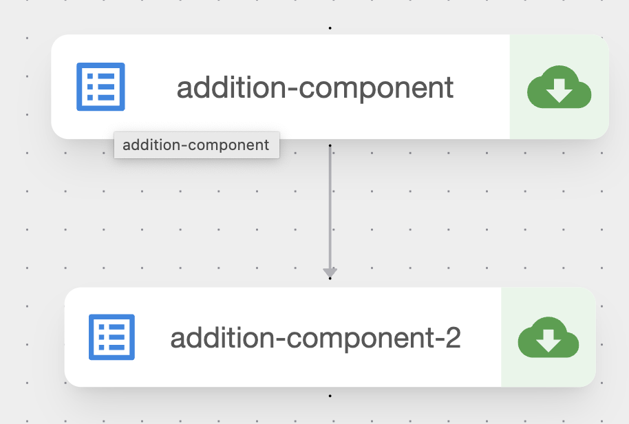
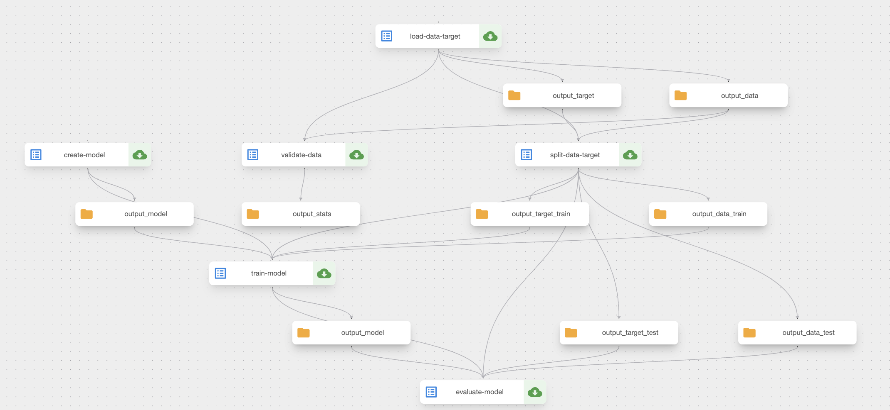

# Kubeflow Demo

Kubeflow demo for the MLOps Community Meetup at Luxembourg.

# Requirements

- [Python](https://www.python.org/)
- [PyInvoke](https://www.pyinvoke.org/)
- [Poetry](https://python-poetry.org/)
- [protobuf](https://developers.google.com/protocol-buffers/docs/overview)
- [Kubeflow Pipelines](https://kubeflow.org/)

# Installation

Please refer to [this guide on Kubeflow Pipelines v2 to install it on your computer](https://fmind.medium.com/how-to-install-kubeflow-on-apple-silicon-3565db8773f3).

Then, open a terminal in the project directory and run the following commands:

```bash
# install the project environment
inv install
# apply Kubeflow Pipelines manifests
inv apply
# setup port forward for the Kubeflow UI
inv ui
```

Remember to activate the Virtual Environment before accessing the project:

```bash
# on Linux and Mac
./.venv/bin/activate
```

# Reproduction

To run the quickstart pipeline from the official documentation (simple example):

```bash
cd src/kdemo/pipelines/
python quickstart.py
```



Run a more advanced pipeline created to showcase Kubeflow Pipelines:

```bash
cd src/kdemo/pipelines/
python wine.py
```



# Errors

## Can't install the kfp package: protobuf is missing

You need to install protobuf to communicate with Kubeflow:

```
# on MacOS
brew install protobuf
```

## Can't execute pipeline function without compilation

The `kfp.client.Client.create_run_from_pipeline_func` function does not work from the quickstart example:

```python
# this code does not work! see error below
run = client.create_run_from_pipeline_func(
    my_pipeline,
    arguments={
        'a': 1,
        'b': 2
    },
)
```

> Error: AttributeError: 'GraphComponent' object has no attribute '__name__'

Instead, you should [compile the pipeline](https://www.kubeflow.org/docs/components/pipelines/v2/compile-a-pipeline/) and call the following function to run it:

```python
run = client.create_run_from_pipeline_package(
    KFP_PIPELINE,
    arguments={
        "a": 1,
        "b": 2,
    },
)
```

## The workflow-controller Pod dies sometime

I noticed that the workflow-controller Pod dies sometimes (e.g., once per week).

There is nothing I could do besides reinstalling Kubeflow entirely.

I haven't analyzed the root cause that triggers this issue.

## Can't set the parallelism argument in dsl.ParallelFor

Setting the parallelism argument causes the Kubeflow API to return an (obscure) 400 error.

Code:
```python
# this example does not work: the parallelism argument creates an error
with dsl.ParallelFor(items=n_neighbors_items, parallelism=2) as n_neighbors:
    create_model_task = create_model(n_neighbors=n_neighbors)
```

Error:
```yaml
ApiException: (400)
Reason: Bad Request
HTTP response headers: HTTPHeaderDict({'X-Powered-By': 'Express', 'content-type': 'application/json', 'date': 'Thu, 29 Sep 2022 06:43:50 GMT', 'content-length': '440', 'connection': 'close'})
HTTP response body: {"error":"Failed to create a new run.: InvalidInputError: unknown template format: pipeline spec is invalid","code":3,"message":"Failed to create a new run.: InvalidInputError: unknown template format: pipeline spec is invalid","details":[{"@type":"type.googleapis.com/api.Error","error_message":"unknown template format","error_details":"Failed to create a new run.: InvalidInputError: unknown template format: pipeline spec is invalid"}]}
```

## Can't write for loop in pipeline with more than one task

I was not able to write a for loop to tune several models at once:

```python
with dsl.ParallelFor(items=n_neighbors_items, name='tune-model') as n_neighbors:
    create_model_task = create_model(n_neighbors=n_neighbors)
    train_model_task = train_model(
        input_model=create_model_task.outputs["output_model"],
        input_data_train=split_data_target_task.outputs["output_data_train"],
        input_target_train=split_data_target_task.outputs["output_target_train"],
    )
    evaluate_model_task = evaluate_model(
        input_model=train_model_task.outputs["output_model"],
        input_data_test=split_data_target_task.outputs["output_data_test"],
        input_target_test=split_data_target_task.outputs["output_target_test"],
    )
```

The error I got is: "component input artifact not implemented yet".

I don't have the error with only one task, but it happends everytime I include two.

## Unable to retrieve node information in the UI when using ParallelFor

The UI doesn't report the status when using a `ParallelFor` control flow.

Thus, users can't look inside the sub DAG and find their solutions with the UI.

The only alternative is to use the command line and debug the K8s pods manually.

## Optional arguments are not supported for components/pipelines

With the new version of Kubeflow Pipelines, you can use optional arguments:

```python
@kfp.dsl.pipeline(name="addition-pipeline")
def my_pipeline(a: int, b: int, c: int = 10):
    add_task_1 = addition_component(num1=a, num2=b)
    add_task_2 = addition_component(num1=add_task_1.output, num2=c)
```

Compiling the pipeline will give you the following error:

```
FP driver: failed to unmarshal component spec, error: unknown field "isOptional" in ml_pipelines.ComponentInputsSpec.ParameterSpec
```

# Problems

## Pod debugging

Most debugging actions require the use of the command-line and kubectl.

For instance, you must use the following command to find an error of dependencies.

```
kubectl logs -n kubeflow wine-pipeline-vw8dp-6510369
```

As mentioned, the Kubeflow Pipelines UI doesn't inform you about the problem:
- The pipeline fails and display an error icon to inform the user
- The task is still marked as running, but we can't access logs
- The only logs available require you to use `kubectl` directly

## Can't tune and select the best model

I couldn't find a good solution to run several models in parallel and select the best one.

A possible solution would be to create a full component dedicated to tuning and selecting the best model at the same time.

But this solution is not a good practice. Ideally, we would like to separate the tuning and the selection in different components.

## Couldn't test the other component definitions

As described in [the documentation](https://www.kubeflow.org/docs/components/pipelines/v2/author-a-pipeline/components/), there are 3 methods to define a component:
1. Lightweight Python function-based component
2. Containerized Python components
3. Custom container components

The 2nd and 3rd approach require the installation of a local Docker registry, or the integration with an existing one.

This step is cumbersome, and I don't see a data scientist using this approach in practice during development.

## Can't use a component without the context of a pipeline

If you create a task from a component (e.g., t = create_model()), then you can't do anything besides using it inside a pipeline.

Moreover, there are no documented practice to test a component. You can only do an integration test with the pipeline.

This limits greatly the flexibility of the solution in development workflow and to build robust MLOps pipelines easily.

## You must import/export your data before/after each component

Since components are isolated, data must be transfered between them whenever a new component is used.

This is verbose and not performant. Moreover, this can incur extra costs for storing all this extra information.

The alternative is to condense all the components into one, but this removes most of the benefit of using Kubeflow.
